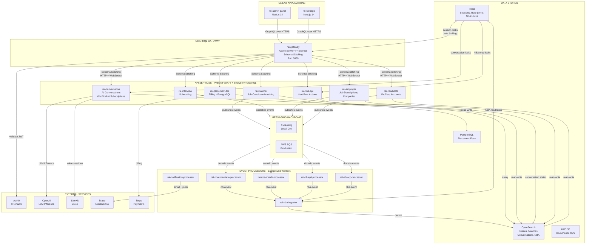
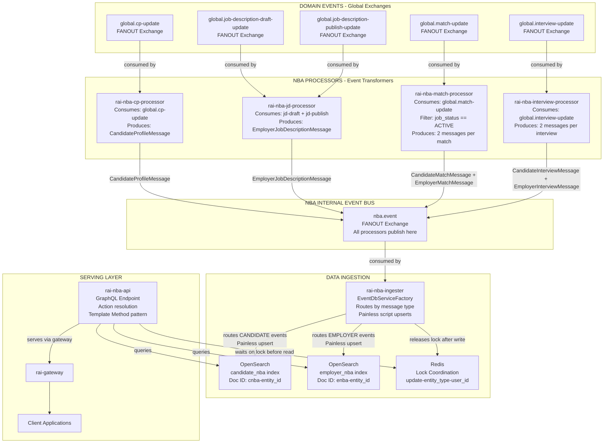
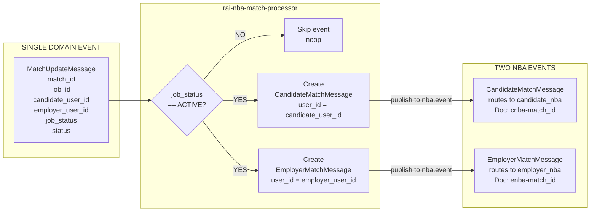
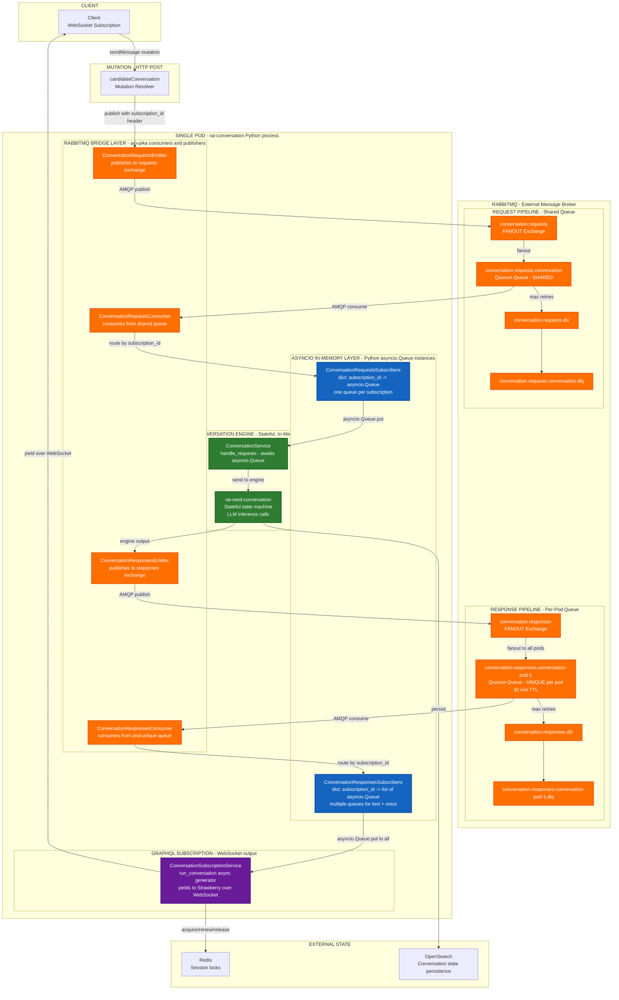
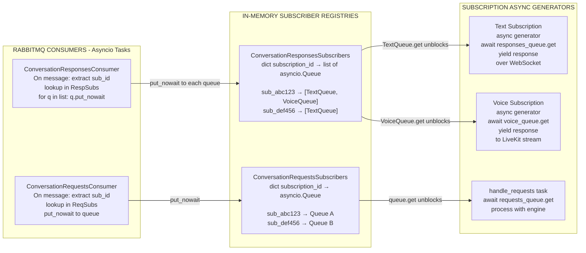
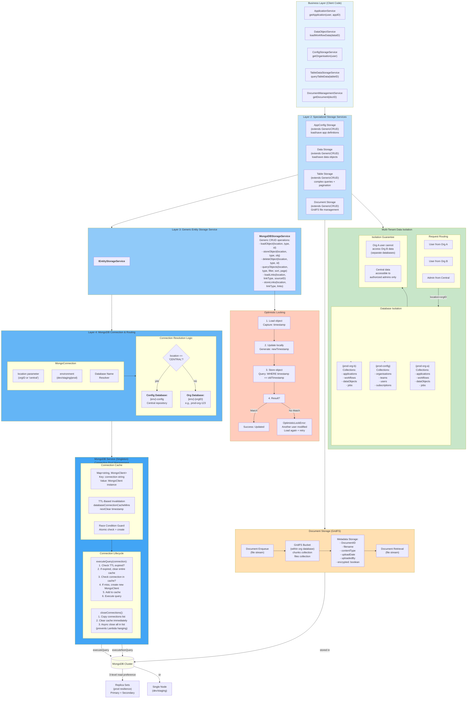

# ReedAI: Architectural Overview

**Prepared by:** Lead BE Developer
**Platform codename:** RAI
**Document date:** March 2026
**Status:** Portfolio reference — technical architect submission


## 1. Executive Summary

Reed AI is an AI-powered recruitment platform that connects candidates and employers through conversational AI interfaces. The platform enables candidates to interact with an AI agent that guides them through their job search, manages their profile, presents matched opportunities, and coordinates interviews — all through natural language conversations. On the employer side, the platform surfaces matched candidates, orchestrates interview pipelines, and pushes contextual "Next Best Actions" to keep hiring workflows moving.

The platform comprises approximately 39 independently deployable services organized into six primary domains: candidate profiles and accounts, employer job descriptions and hiring pipelines, AI-driven conversations, job-candidate matching, NBA event processing, and notifications. The technology stack is deliberately polyglot: Python 3.12 handles all AI and ML-heavy backend work where the ecosystem is richest; TypeScript powers the frontends and the GraphQL gateway where type-safety at the interface boundary matters most. The two runtimes are connected by a GraphQL schema-stitched gateway that gives clients a single unified endpoint regardless of which downstream service owns a particular type.

My role on this platform was lead BE developer. I designed the GraphQL gateway's schema-stitching approach, selecting it over Apollo Federation for reasons I explain in detail in Section 3. I designed the NBA event processing pipeline, including the fan-in/fan-out architecture that decouples domain events from action computation. I designed the conversation subscription infrastructure, which required solving a genuinely hard distributed systems problem: how do you deliver real-time AI responses over GraphQL subscriptions when the conversation engine is stateful and cannot be distributed? The solution I arrived at — a double-queue RabbitMQ pattern with per-pod unique queues and an in-memory subscriber registry bridge — is the most architecturally interesting piece of work I did on this platform, and I cover it in depth in Section 5.

## 2. System Overview and Technology Decisions

### The Problem Space

Recruitment as a domain has several properties that strongly influenced architecture choices. The data is semi-structured: a candidate profile is not a fixed relational schema — it has free-text fields, optional sections, nested arrays of experiences, skills that need vector representation for semantic matching, and document attachments. Job descriptions are similarly irregular. Traditional relational databases impose schema rigidity that fights this domain.

Different parts of the system also have radically different latency and consistency requirements. A candidate updating their profile needs transactional correctness within that operation, but the propagation of that update to the NBA pipeline can tolerate seconds of eventual consistency. Conversations must feel real-time to users even though they're backed by LLM inference that takes 500ms to several seconds. Notifications can be asynchronous. These differing requirements pushed us toward a service boundary design that separates read-heavy, document-store-backed services from write-heavy, event-producing ones.

### Why Microservices

We made the decision to use microservices for reasons grounded in team and deployment autonomy. The recruitment domain has genuinely distinct bounded contexts: the candidate domain (profiles, accounts, documents), the employer domain (companies, job descriptions, hiring pipelines), the conversation domain (stateful AI sessions, voice, message history), the matching domain (similarity scoring, ranking), the NBA domain (event processing, action computation), and notifications. These are owned by different teams, change at different rates, and have different scaling profiles.

The shared library approach published to AWS CodeArtifact lets us share domain models, authentication logic, and infrastructure patterns without creating import coupling between services. Each service declares a versioned dependency on the library it needs; library updates are opt-in via version bumps.

### Why GraphQL over REST

GraphQL was the right choice here for two concrete reasons. First, the frontend applications have complex, relationship-rich data needs. A candidate's dashboard might need profile completeness data, recent matches, upcoming interviews, and current NBA actions — all in a single screen render. With REST, that would be four API calls with significant over-fetching. With GraphQL and schema stitching, the client makes one request and specifies exactly the fields it needs from whichever downstream services own those types.

Second, schema introspection provides a self-documenting API contract. Tooling like Apollo Client's code generation can derive TypeScript types from the schema, making the contract between frontend and backend enforceable at compile time rather than runtime.


### Why OpenSearch over Traditional RDBMS

The primary data store for most services is OpenSearch. We chose OpenSearch as the primary store for several reasons. The candidate profile and employer job description data is fundamentally document-shaped — it does not fit neatly into relational tables without either significant denormalization or join-heavy queries that degrade under scale. OpenSearch's document model accommodates schema evolution without migration-driven deployments: adding a new field to a profile document does not require an ALTER TABLE.

More importantly, the matching domain requires vector search. Candidate skills need to be embedded and compared against job description embeddings for semantic similarity. OpenSearch's k-NN plugin provides this capability within the same store that holds the documents being searched, avoiding the operational complexity of a separate vector database. Using one store for both full-text search and vector similarity search simplified the matching service considerably.

PostgreSQL appears only in couple of services where true ACID transactions are non-negotiable.

### Why RabbitMQ and SQS Dual-Mode

The messaging library presents a unified interface that hides whether the underlying broker is RabbitMQ (local development) or SQS (production). This dual-mode approach was a pragmatic decision: RabbitMQ runs locally in Docker Compose and provides a rich management UI for debugging during development. SQS is the appropriate production choice on AWS — it is managed, scales without operator intervention, and integrates naturally with IAM.

The abstraction in messaging means services declare their message consumption and publishing in terms of the library's interface; the choice of broker is determined by environment configuration. This worked well for the outbox-based services. The conversation service is an exception I will address in Section 5: it uses RabbitMQ directly in both environments because it requires pub/sub semantics with per-pod queue routing that SQS cannot provide.

Quorum queues are used throughout RabbitMQ configurations. Quorum queues provide leader-election-based replication across the cluster, making them durable across node failures. Classic queues were rejected because they can lose messages during broker restarts. Every service also configures dead-letter exchanges (DLX) and dead-letter queues (DLQ) so that messages that exceed retry limits are captured for inspection rather than silently dropped.

### Why Strawberry over Ariadne

For the Python GraphQL services, We chose Strawberry over Ariadne. The deciding factor was type safety. Strawberry uses Python dataclasses and decorators to define the schema from code, integrates naturally with Pydantic for input validation, and provides type-checked resolver signatures. Ariadne uses a schema-first approach where the SDL is defined separately from the resolver functions, creating a runtime binding that cannot be checked by mypy.

In a platform where we were already enforcing strict typing via mypy and Ruff, choosing Ariadne would have created a type-unsafe gap precisely at the API boundary — the most important place to catch mismatches. Strawberry's code-first approach keeps schema definition and implementation co-located and type-checked.

### High-Level System Diagram


## 3. The GraphQL Gateway

### What the Gateway Does

GraphQL Gateway is a TypeScript service built on Apollo Server 4 and Express 4. It is the single entry point for all client traffic. It stitches together the GraphQL schemas of all downstream services into one unified schema, authenticates requests, rate-limits them, and routes resolved fields to the appropriate downstream service.

### Schema Stitching, Not Apollo Federation

I want to be direct about this decision: I chose schema stitching via `@graphql-tools/stitch` over Apollo Federation.

Apollo Federation is the right choice when all downstream services are designed from the start to implement the Federation spec — meaning they use `@key` directives, expose `_entities` resolvers, and participate in a subgraph protocol. In practice, the downstream services on this platform are heterogeneous. Some are Python Strawberry services that have their own schema conventions. Some were added incrementally. Getting all of them to conform to the Federation subgraph protocol would have required significant rework of each service's schema design.

Schema stitching works with any GraphQL endpoint that supports introspection. You fetch the remote schema at startup, merge it into a unified schema, and route based on type ownership. There is no subgraph protocol contract to implement downstream. Given the heterogeneous service landscape I was working with, this was the correct pragmatic choice.

The trade-off I accepted is that the gateway must restart when any downstream service deploys a schema change. With Federation, the gateway can pick up subgraph changes without restarting. With schema stitching, the startup-time schemas are the schemas. The liveness probe (described below) detects schema drift and triggers a restart, so the operational gap is manageable.

### The Four JWT Authentication Paths

Authentication is one of the more complex pieces of the gateway. The platform has four distinct issuer paths, tried in sequence until one succeeds:

1. **Internal RSA** — Service-to-service calls use asymmetric key verification. The issuing service signs a JWT with a private key; the gateway verifies with the corresponding RSA public. This is fast — local cryptographic verification, no network call.

2. **Auth0 Admin** — Admin users and operators authenticate through a dedicated Auth0 tenant.

3. **Auth0 Employer** — Hiring managers and employers authenticate through a separate Auth0 tenant.
4. **Auth0 Candidate** — Job seekers authenticate through a third Auth0 tenant.

The reason for separate tenants rather than one Auth0 tenant with roles is isolation. Employer and candidate accounts should never share a user pool. An employer credential should not be valid against candidate-scoped resources. By using separate tenants with separate JWKS endpoints, the token itself carries its domain membership in its issuer claim, and the gateway can set `appType` from which issuer path succeeded.

Once authentication succeeds, the gateway creates a context object that is injected into all downstream requests

### Two-Tier Rate Limiting

Rate limiting is Redis-backed via `rate-limiter-flexible` and `ioredis`. There are two tiers:

**Global limit**: 100 requests per 60-second window per `userId`. This applies to all operations.

**Conversation limit**: 50 requests per 60-second window per `userId`. This applies only to conversation mutations. 

The reason for a separate, tighter conversation tier is cost. Each conversation message triggers LLM inference — GPT-4-class models at 500ms to several seconds per response. At 100 requests per minute globally, a user could spam the conversation endpoint and drive significant inference costs. The dedicated conversation limit at 50 per minute gives the general tier room for dashboard queries, profile fetches, and other cheap operations while constraining the expensive path separately.

## 4. The NBA Next Best Actions Pipeline

### The Problem I Was Solving

Recruitment has a fatigue problem. Candidates apply and then go silent because they don't know what to do next. Employers post jobs and then miss qualified candidates because they're not actively monitoring. The NBA pipeline's purpose is to compute, at near-real time, "what should this user do next?" and surface those actions prominently in the UI.

The inputs are domain events: a candidate updates their profile, a match is created, an interview is scheduled, a job description is published. Each of these events implies actions on both the candidate and employer side. The NBA system processes these events, determines the appropriate actions for each user, and persists them in a queryable form so the read only service can serve them to the frontend.

The design requirement was near-real-time: NBA actions should update within seconds of the triggering domain event. The challenge was doing this across multiple event sources, for both candidates and employers, without tight coupling between the domain services and the NBA computation logic.

### Fan-In / Fan-Out Architecture

The architecture I designed separates domain event production from NBA-specific processing with a fan-in / fan-out pattern:

**Fan-in**: Four domain processors consume events from their respective global exchanges and transform them into a common NBA event format. All processors publish to a single central exchange: `nba.event` (FANOUT). This is the fan-in: many domain sources → one NBA bus.

**Fan-out**: A single `rai-nba-ingester` consumes from `nba.event` and routes events to the appropriate OpenSearch index. This is where persistence happens.



### Dual-Perspective Events

The most interesting behavior in the NBA pipeline is dual-perspective event generation. A match between a candidate and an employer is a single domain event on the `global.match-update` exchange. But it represents an event that is meaningful to two different users.

The `rai-nba-match-processor` consumes one `MatchUpdateMessage` and, if the job status is ACTIVE, produces two NBA events:

1. A `CandidateMatchMessage` with `user_id = candidate_user_id` — this drives NBA actions for the candidate (e.g., "You have a new match, view the role")
2. An `EmployerMatchMessage` with `user_id = employer_user_id` — this drives NBA actions for the employer (e.g., "New candidate matched, review their profile")

The same pattern applies in `rai-nba-interview-processor` for interview events: one `InterviewUpdateMessage` produces both a `CandidateInterviewMessage` and an `EmployerInterviewMessage`.



This design keeps the downstream ingester and API completely unaware of which upstream event type triggered an NBA update. The ingester sees only the six NBA message types: `CandidateProfileMessage`, `CandidateMatchMessage`, `CandidateInterviewMessage`, `EmployerJobDescriptionMessage`, `EmployerMatchMessage`, `EmployerInterviewMessage`. The `EventDbServiceFactory` routes each to the appropriate OpenSearch index. The processor layer owns the fan-out logic.

### Timestamp-Ordered Upserts

The ingester uses OpenSearch Painless scripts to implement "only update if newer" semantics. This is critical because RabbitMQ does not guarantee ordering. An older event can arrive after a newer one due to processing delays, retries, or network non-determinism.

### Redis Lock Coordination

The NBA API has a read-after-write consistency requirement. When a candidate updates their profile, they expect to see updated NBA actions in their dashboard shortly after. The event processing pipeline introduces latency: the event travels from the candidate service to the exchange, is consumed by the processor, re-published to exchange, consumed by the ingester, and persisted to OpenSearch. During this window, a dashboard query would return stale data. The solution is Redis lock coordination. The upstream service sets a Redis lock key before publishing the domain event.

## 5. The Conversation Service — The Hardest Problem I Solved

### The Problem Space

The conversation service is, without question, the most architecturally complex piece of this platform. I want to be precise about what made it hard, because the solution only makes sense in the context of the constraints.

The conversation experience works as follows: a user (candidate or employer) opens a chat interface in the web app. They send messages; the AI agent responds. The agent maintains context across the conversation — it knows what the user has said before, what their profile contains, what matches are available, what the current NBA actions are. This context is maintained by service developed by other team, a stateful conversation engine that holds the conversation state machine, history, and engine internals in memory. This creates a hard architectural constraint: **a single conversation cannot be distributed across multiple pods**. The conversation engine is in-memory and stateful. If message 1 is processed by pod A and message 2 arrives at pod B, pod B has no knowledge of message 1. The conversation would be incoherent.

Now layer on the real-time requirement: **responses must be delivered to the client over GraphQL subscriptions via WebSocket**. GraphQL subscriptions require a persistent WebSocket connection, and WebSocket connections are inherently pod-affine — once established, the client is connected to a specific pod for the duration of the subscription.

And now the compound problem: **GraphQL mutations (the user sending a message) arrive on ANY pod** via the load balancer. The mutation might land on pod A while the subscription lives on pod B. Even if the mutation lands on pod A and we process the message there, the response needs to reach the WebSocket connection on pod B.

Finally: **LiveKit voice mode** needs to receive the same conversation responses as the text chat, simultaneously, in real-time. Voice is a second subscriber to the same conversation's output.

These constraints together ruled out the simple approaches:
- Sticky sessions would keep mutations on the subscription pod, but do not survive pod restarts and complicate load balancing
- Shared in-memory state (Redis) for the conversation engine would require serializing complex stateful objects on every request — too slow and too complex for streaming state machines
- Having the mutation block and wait synchronously for the engine response would tie up the HTTP connection for several seconds during LLM inference

The solution I arrived at is what I call the **double-queue pattern**.

### The Core Insight: Decouple Mutation Pod from Subscription Pod

The key insight is this: the mutation does not need to process the message. Its only responsibility is to accept the user's input and put it somewhere the right pod can find it. The subscription's pod does the processing.

This shifts the routing problem from "how do I get the mutation to the right pod?" to "how do I get the message from the mutation to the subscription's asyncio event loop?" The answer is RabbitMQ.

The mutation publishes the user's message to a RabbitMQ exchange. The subscription's pod has a consumer listening on a queue bound to that exchange. The consumer receives the message and routes it into the subscription's in-memory processing loop via an `asyncio.Queue`. The engine processes the message, produces a response, and the response is published to a second RabbitMQ exchange. From there it is routed back to the subscription's `asyncio.Queue` and yielded over the WebSocket.

The two pipelines — request routing and response delivery — have fundamentally different topological requirements, which is why they are designed differently.

### Pipeline 1: The Request Pipeline — Shared Queue

```
Exchange: conversation.requests (FANOUT, durable)
Queue: conversation.requests.conversation (Quorum, shared across all pods)
DLX: conversation.requests.dlx (FANOUT, durable)
DLQ: conversation.requests.conversation.dlq (Quorum, durable)
```

The request pipeline uses a single shared queue consumed by all pods in a competing-consumer pattern. When a mutation publishes a user message, it goes to the `conversation.requests` FANOUT exchange. The exchange delivers it to the single shared `conversation.requests.conversation` queue. Whichever pod's `ConversationRequestsConsumer` picks it up looks up the `subscription_id` in the `ConversationRequestsSubscribers` registry — an in-memory `dict[str, asyncio.Queue]`. If the subscription is registered on this pod, the message is put into the subscription's `asyncio.Queue`.

Why a shared queue? Because in the current deployment, the conversation service runs as a single pod. The conversation engine's statefulness forces single-pod deployment. With one pod, a shared queue is exactly right: there is one consumer and it receives every message. The design is architecturally correct — it could support multiple pods if each hosted different conversations — but the known limitation (described below) means it is currently only safe at one pod.

### Pipeline 2: The Response Pipeline — Per-Pod Unique Queues

```
Exchange: conversation.responses (FANOUT, durable)
Queues: conversation.responses.conversation-{HOSTNAME} (Quorum, unique per pod, 30-minute TTL, auto-delete)
DLX: conversation.responses.dlx (FANOUT, durable)
DLQs: conversation.responses.conversation-{HOSTNAME}.dlq (per pod)
```

The response pipeline uses a unique queue per pod. When the conversation engine produces a response, the `ConversationResponsesEmitter` publishes it to the `conversation.responses` FANOUT exchange. Because it is a FANOUT exchange, every bound queue receives the message — meaning every pod's unique queue receives every response. Each pod's `ConversationResponsesConsumer` looks up the `subscription_id` in its `ConversationResponsesSubscribers` registry. Only the pod that hosts the subscription finds a match; all other pods silently drop the message.

Why per-pod queues for responses? Because the response must be delivered to the correct pod — the one hosting the WebSocket connection for this subscription. A shared queue would cause the response to be consumed by an arbitrary pod. A FANOUT to per-pod queues guarantees that the correct pod receives the message (it's the only one with the subscription in its registry).

The 30-minute TTL with auto-delete on the response queues means that if a pod goes down, its queue eventually expires and is cleaned up automatically. If the pod restarts, it declares a new queue with its new hostname.

The health check exchange is a separate DIRECT, non-durable, auto-delete exchange named `conversation-health`. It is used by the readiness probe to verify RabbitMQ connectivity — the probe publishes to this exchange and confirms the publish succeeds.

### The Double-Queue Topology in Full



The diagram above separates the system into four clearly distinct layers:

- **Orange — RabbitMQ**: The external message broker and the aio-pika bridge code that publishes to and consumes from it. This is the network boundary — messages cross between pods (or between the mutation HTTP handler and the subscription's event loop) via AMQP.
- **Blue — asyncio in-memory**: The `asyncio.Queue` instances that live purely in Python process memory. These are the subscriber registries that bridge the RabbitMQ consumer tasks to the GraphQL subscription generators. No network, no serialization — just pointer handoffs within a single Python process.
- **Green — Conversation engine**: The stateful conversation engine and request handler. This is where LLM calls happen and conversation state is maintained in memory.
- **Purple — WebSocket output**: The GraphQL subscription generator that yields responses to the client over WebSocket.

- ### The Subscriber Registry Bridge

The architectural innovation that makes the double-queue pattern work is the in-memory subscriber registry. RabbitMQ consumers run in their own asyncio task. GraphQL subscriptions are async generators yielding to Strawberry over the WebSocket. These two worlds need to communicate. The registries are the bridge.

**`ConversationRequestsSubscribers`**: A singleton `dict[str, asyncio.Queue]`. When a subscription starts, it registers an `asyncio.Queue` under its `subscription_id`. When the `ConversationRequestsConsumer` receives a message from RabbitMQ, it extracts the `subscription_id` from the message headers, looks it up in this dict, and calls `queue.put_nowait(message)`. The conversation service's `handle_requests()` task awaits `queue.get()`, blocking until a message arrives.

**`ConversationResponsesSubscribers`**: A singleton `dict[str, list[asyncio.Queue]]`. The value is a list rather than a single queue. When the primary text subscription starts, it registers one `asyncio.Queue`. When the voice subscription starts, it adds a second `asyncio.Queue` to the same `subscription_id`'s list. When the `ConversationResponsesConsumer` receives a response, it fans out to every queue in the list — both the text subscriber and the voice subscriber receive the same response simultaneously.

Why `list[Queue]` for responses? This is how voice mode is implemented. LiveKit voice requires the same engine output as the text chat. Instead of duplicating the conversation engine processing (which would be both expensive and incoherent — you'd get different LLM responses), the voice subscription registers a second queue in the responses registry for the same `subscription_id`. A single engine response fans out to both queues. The text subscription resolver and the voice subscription resolver each consume from their own queue and may apply different filtering or formatting to the shared response.



## 7. Infrastructure, GitOps, and Deployment

### The GitOps Approach

The deployment strategy for Reed AI is built on a GitOps model using ArgoCD with Kustomize overlays. The principle is declarative infrastructure: every piece of configuration that describes the running state of the platform lives in git. ArgoCD continuously reconciles the desired state in git against the actual state in the cluster. If someone manually changes a deployment in the cluster, ArgoCD detects the drift and reverts it. If a service's infrastructure repository receives a new image tag, ArgoCD syncs the change automatically. There is no `kubectl apply` in CI pipelines — the pipeline's job is to update the manifest repository; ArgoCD's job is to apply it.

We chose GitOps over imperative CI/CD-driven deployments for several reasons. First, auditability: every deployment is a git commit with an author, timestamp, and diff. Second, reproducibility: the cluster can be rebuilt from scratch by pointing ArgoCD at the manifest repositories. Third, drift detection: manual changes to the cluster are immediately flagged and corrected. For a platform with 19+ deployed services across four environments, these properties are essential for operational sanity. All production services run as Docker containers on AWS EKS (Elastic Kubernetes Service) in the eu-west-2 (London) region. The London region choice is driven by GDPR compliance requirements for a UK-based recruitment platform — candidate personal data must reside in the EU.

## A Note on Scope

All production services run as Docker containers on AWS EKS (Elastic Kubernetes Service) in the eu-west-2 (London) region. The London region choice is driven by GDPR compliance requirements for a UK-based recruitment platform — candidate personal data must reside in the EU.

------------------------------------------------------------------------------------------------------------------------------------------------------------------------------------------------------------------------------------------------------

# MDX Workflow (IceFlow): Architectural Overview

**Prepared by:** Lead Developer / CO-CTO
**Platform codename:** IceFlow
**Document date:** March 2026
**Status:** Portfolio reference — technical architect submission


## 1. Executive Summary

MDX Workflow — internally codenamed IceFlow — is an enterprise-grade workflow automation platform designed to orchestrate complex, multi-step business processes in highly regulated industries, primarily financial services. The platform allows organisations to model arbitrary approval chains, data-collection flows, external system integrations, and human-in-the-loop decision points, all without bespoke code per use case. At its core, it is a configurable process execution engine with a fully managed lifecycle: from the initial form submission, through automated and manual processing stages, parallel execution branches, rejection and resubmission cycles, and final completion with a full audit trail.

**My role on this project was Lead Developer / CO-CTO and I was involed in every architectural decision, and having full ownership on couple of them**

## 2. System Overview and Technology Decisions

### The Deployment Topology at a Glance

Before diving into individual decisions, it is worth establishing the high-level shape of the system. MDX Workflow is a single product that runs identically on two cloud providers, controlled by environment configuration rather than conditional code paths.

```mermaid
graph TB
    subgraph AWS["AWS DEPLOYMENT (Left)"]
        direction TB

        subgraph AWSVPC["VPC (Private Network)"]
            direction TB

            subgraph Public["Public Subnet"]
                R53["Route53<br/>DNS + Health Check"]
                ACM["ACM Certificate<br/>HTTPS TLS"]
                ALB["Application Load Balancer<br/>Port 443 HTTPS"]
            end

            subgraph Private["Private Subnet (1-4 Instances)"]
                ECS["ECS Fargate Cluster<br/>(Container Orchestration)"]

                subgraph Containers["Container Instances"]
                    C1["Container 1<br/>Port 3000"]
                    C2["Container 2<br/>Port 3000"]
                    C3["Container 3<br/>Port 3000"]
                end

                ECS --- C1
                ECS --- C2
                ECS --- C3

                SG1["Security Group<br/>(ALB → ECS)"]
            end

            subgraph DataLayer["Data Layer"]
                DocumentDB["DocumentDB Cluster<br/>(MongoDB Compatible)<br/>Primary + Replicas"]
                SG2["Security Group<br/>(ECS → DocumentDB)"]
            end

            subgraph Messaging["Messaging & Jobs"]
                SQS["SQS Queue<br/>(Non-FIFO)<br/>Batch Size: 5<br/>Visibility: 300s"]
                SNS["SNS Topic<br/>(Notifications)"]
                EB["EventBridge<br/>(Event Router)"]
            end

            subgraph Compute["Serverless Compute"]
                JobWorker["Lambda Job Worker<br/>Memory: 3008 MB<br/>Timeout: 900s<br/>Concurrency: 20<br/>VPC-Attached"]
                PDFWorker["Lambda PDF Worker<br/>Memory: 10240 MB<br/>Function URL<br/>(Direct Invoke)"]
                S3Bucket["S3 Bucket<br/>(Chromium Binary)"]
            end

            subgraph Observability["Observability & Ops"]
                CloudWatch["CloudWatch<br/>- Logs<br/>- Alarms<br/>- Dashboard<br/>- Metrics"]
                IAMRole["IAM Roles<br/>- ECS Task Role<br/>- Lambda Role"]
            end

            SG1 -.-> Private
            SG2 -.-> DataLayer
        end

        subgraph ASG["Auto Scaling"]
            ASGConfig["ASG Policy<br/>Target: 60-70% CPU<br/>Step Scaling<br/>Min: 1, Max: 4<br/>Scale-up: +1 instance<br/>Scale-down: -1 instance"]
        end

        R53 --> ALB
        ACM --> ALB
        ALB --> C1
        ALB --> C2
        ALB --> C3

        C1 --> DocumentDB
        C2 --> DocumentDB
        C3 --> DocumentDB

        C1 --> SQS
        C2 --> SQS
        C3 --> SQS

        SQS --> JobWorker
        JobWorker --> DocumentDB

        C1 -.->|Function URL| PDFWorker
        PDFWorker --> S3Bucket
        PDFWorker --> CloudWatch

        JobWorker --> CloudWatch
        DocumentDB --> CloudWatch

        EB --> SNS
        SNS --> CloudWatch

        style AWS fill:#FF9900,stroke:#232F3E,stroke-width:3px,color:#000
        style AWSVPC fill:#fff,stroke:#FF9900,stroke-width:2px
        style ECS fill:#FF9900,stroke:#232F3E,stroke-width:2px,color:#fff
        style C1 fill:#0073bb,stroke:#FF9900,stroke-width:2px,color:#fff
        style C2 fill:#0073bb,stroke:#FF9900,stroke-width:2px,color:#fff
        style C3 fill:#0073bb,stroke:#FF9900,stroke-width:2px,color:#fff
        style DocumentDB fill:#527fff,stroke:#232F3E,stroke-width:2px,color:#fff
        style SQS fill:#FF9900,stroke:#232F3E,stroke-width:2px,color:#fff
        style JobWorker fill:#FF9900,stroke:#232F3E,stroke-width:2px,color:#fff
        style PDFWorker fill:#FF9900,stroke:#232F3E,stroke-width:2px,color:#fff
        style ALB fill:#FF9900,stroke:#232F3E,stroke-width:2px,color:#fff
        style R53 fill:#FF9900,stroke:#232F3E,stroke-width:2px,color:#fff
        style ACM fill:#FF9900,stroke:#232F3E,stroke-width:2px,color:#fff
        style CloudWatch fill:#FF9900,stroke:#232F3E,stroke-width:2px,color:#fff
    end

    subgraph Shared["SHARED APPLICATION (Center)"]
        direction TB

        subgraph Docker["Multi-Stage Docker Build"]
            Builder["Stage 1: Builder<br/>Node 18-alpine<br/>- npm install<br/>- npm run build<br/>- Build TypeScript"]
            Runtime["Stage 2: Runtime<br/>Node 18-alpine<br/>COPY --from=builder<br/>- Compiled JS<br/>- node_modules"]
        end

        subgraph AppRuntime["Application Runtime"]
            PM2["PM2 Process Manager<br/>- Cluster Mode<br/>- Auto Restart<br/>- Health Check<br/>- Graceful Shutdown"]
            APP["TypeScript Application<br/>- Express Server<br/>- Workflow Engine<br/>- Runtime Factories<br/>- Step/Connection/Function<br/>Execution"]
        end

        Builder --> Runtime
        Runtime --> PM2
        PM2 --> APP

        style Shared fill:#f0f0f0,stroke:#333,stroke-width:2px
        style Docker fill:#2496ed,stroke:#333,stroke-width:2px,color:#fff
        style Builder fill:#2496ed,stroke:#333,stroke-width:2px,color:#fff
        style Runtime fill:#2496ed,stroke:#333,stroke-width:2px,color:#fff
        style PM2 fill:#2d3436,stroke:#333,stroke-width:2px,color:#fff
        style APP fill:#27ae60,stroke:#333,stroke-width:2px,color:#fff
    end

    subgraph Azure["AZURE DEPLOYMENT (Right)"]
        direction TB

        subgraph RG["Resource Group"]
            direction TB

            subgraph Network["Virtual Network & Security"]
                PE["Private Endpoints<br/>(Secure Access)"]
                NSGAE["Network Security Group<br/>(Inbound: 443 only)"]
                VNET["Virtual Network<br/>(Private Address Space)"]
            end

            subgraph AppServices["Container Services"]
                AppService["App Service (Premium)<br/>Container (Linux)<br/>1-4 Instances<br/>Auto-scale: 60-70% CPU"]
                ACR["Azure Container Registry<br/>(Docker Image Store)"]
                DeplPolicy["Deployment Policy<br/>- Blue-Green Deploy<br/>- Auto Restart"]
            end

            subgraph Database["Data Layer"]
                CosmosDB["CosmosDB<br/>(MongoDB API)<br/>Geo-Replicated<br/>RU: Auto-scale"]
                DataPE["Private Endpoint<br/>→ CosmosDB"]
            end

            subgraph ServerlessAz["Serverless Functions"]
                JobFunc["Azure Function<br/>Job Worker<br/>Runtime: Node 18<br/>Memory: 1.5 GB<br/>Concurrency: 20"]
                PDFFunc["Azure Function<br/>PDF Worker<br/>Runtime: Node 18<br/>Trigger: HTTP<br/>(Direct URL)"]
                BlobPDF["Blob Storage<br/>(Chromium Binary)"]
            end

            subgraph Messaging["Message Queue & Events"]
                StorageQ["Storage Queue<br/>Batch Size: 5<br/>TTL: 7 days"]
                EventGrid["Event Grid<br/>(Event Routing)"]
            end

            subgraph Monitoring["Monitoring & Auth"]
                AppInsights["Application Insights<br/>- Logs<br/>- Performance<br/>- Tracing"]
                ManagedId["Managed Identities<br/>- App Service ID<br/>- Function ID"]
            end

            VNET --> PE
            VNET --> NSGAE
            ACR --> AppService
            AppService --> CosmosDB
            DataPE -.-> CosmosDB
            AppService --> StorageQ
            StorageQ --> JobFunc
            JobFunc --> CosmosDB
            AppService -.->|HTTP URL| PDFFunc
            PDFFunc --> BlobPDF
            PDFFunc --> AppInsights
            JobFunc --> AppInsights
            EventGrid --> AppInsights
            ManagedId -.-> CosmosDB
            ManagedId -.-> BlobPDF

            style RG fill:#0078d4,stroke:#333,stroke-width:2px,color:#fff
        end

        style Azure fill:#0078d4,stroke:#333,stroke-width:3px,color:#fff
        style AppService fill:#00bcf2,stroke:#333,stroke-width:2px,color:#000
        style CosmosDB fill:#00bcf2,stroke:#333,stroke-width:2px,color:#000
        style JobFunc fill:#00bcf2,stroke:#333,stroke-width:2px,color:#000
        style PDFFunc fill:#00bcf2,stroke:#333,stroke-width:2px,color:#000
        style ACR fill:#00bcf2,stroke:#333,stroke-width:2px,color:#000
        style AppInsights fill:#00bcf2,stroke:#333,stroke-width:2px,color:#000
        style StorageQ fill:#00bcf2,stroke:#333,stroke-width:2px,color:#000
    end

    subgraph Users["CLIENTS"]
        WebBrowser["Web Browser<br/>(Angular SPA)"]
        API["External API<br/>(Consumers)"]
    end

    Users -->|HTTPS Port 443| AWS
    Users -->|HTTPS Port 443| Azure

    AWS -->|Shared Image| Shared
    Azure -->|Shared Image| Shared

    Note["Note: Containers pull from respective registries (ECR for AWS, ACR for Azure)<br/>but run identical compiled application code from shared Dockerfile.<br/>DNS routing (Route53/Traffic Manager) selects active region."]

    style Users fill:#e8e8e8,stroke:#333,stroke-width:2px
    style Note fill:#fff9c4,stroke:#f57f17,stroke-width:2px
```


### TypeScript End-to-End

The decision to use TypeScript for every layer — Angular frontend, Express backend, shared models, test suite — was deliberate and has paid significant dividends. The `common/` directory serves as a shared contract layer between client and server. Domain models, API request/response shapes, calculation engine code, and data-field utilities all live there and are compiled by both sides. This eliminates an entire class of integration bugs: when a backend team member changes a field name in a data model, the TypeScript compiler immediately flags the client code that used the old name.

### MongoDB over Relational

The data model for a configurable workflow platform is fundamentally irregular. An organisation might define an application with fifteen custom fields. Another might define one with two hundred. The data object produced when a user fills in a form for that application must store exactly those fields — no more, no less. A relational schema would require either an entity-attribute-value anti-pattern (which destroys query efficiency and type safety), or dynamic schema migration every time an organisation changes their application definition (operationally dangerous in a multi-tenant SaaS). MongoDB's document model handles this naturally: each data object is a JSON document whose structure mirrors the application definition. The schema is enforced at the application level through TypeScript types, not at the database level through rigid column definitions.

### Layered Monolith with Async Workers

The architectural pattern is a layered monolith — not microservices. The presentation layer (Angular), API layer (Express controllers), business logic layer (services), and storage layer (MongoDB wrappers) are all deployed as a single Express process per container. This was the right call for the stage of the product and the team size.

## 4. Dependency Injection and Service Composition

### The Scale of the Container

The IoC container registers over 100 services. This is not an accident of growth — it is a deliberate commitment to interface-based design throughout. Every service that has an external dependency (database, queue, email, REST API) is registered behind an interface. Every caller receives an `I`-prefixed interface type, not a concrete class. The concrete class is resolved by the container at startup. The problem it solves: the workflow engine needs to execute steps of 30+ distinct types (manual edits, approvals, calculations, email sends, REST API calls, Salesforce updates, and so on). The naive implementation would be a large switch statement in the engine itself, with a case for each step type. This violates the Open/Closed Principle: adding a new step type requires modifying the engine, which is the highest-risk component in the system.

## 5. Data Architecture and Multi-Tenancy

### Database-Per-Tenant Isolation

Multi-tenancy is a fundamental architectural constraint for a SaaS product, and the isolation model is the most consequential design decision in this space. We chose database-per-tenant isolation.

### The Four-Layer Storage Abstraction

The storage layer is designed in four layers, each with a clear responsibility boundary.

The **business service layer** calls storage using business-level operations: `getOrganisation(user)`, `loadWorkflowData(dataID)`, `getApplication(user, appID)`. These callers are completely unaware of MongoDB.

The **specialised storage service layer** maps business concepts to generic CRUD operations. Sepcific services implement or extend a common CRUD pattern, adding domain-specific validation and query logic.

The **generic entity storage layer** — Every object persisted to the database passes through this layer. The `storeObject` implementation embeds optimistic locking: it writes with a `WHERE _ts == originalTimestamp` condition and throws an `OptimisticLockError` if the condition fails, indicating a concurrent modification.

The **connection layer** — `MongoDBService` — handles client creation, caching, and routing to the correct database based on the `location` parameter.

This layering means that adding a new type of stored entity requires a new specialised service and possibly a new interface, but the generic CRUD machinery and the connection pooling require no modification. The same MongoDB code handles every entity type in the system.

## A Note on Scope

This project overview covers the architectural decisions that can be understood on their own — the technology choices, deployment patterns, multi-tenancy model and infrastructure design. These are the decisions that translate across domains and can be evaluated without deep knowledge of the business rules.

What this document does not attempt to cover in full is the complexity inside the workflow engine itself: the state machine transitions, the conditional branching logic, the loop detection algorithms, the dynamic field resolution across nested workflow switches, the interaction between parallel execution streams and rejection/resubmission cycles, and the edge cases that emerge when all of these features combine in a single workflow definition. Those decisions were equally deliberate and arguably harder — but they require the domain context of the product to evaluate properly and are beyond the scope of a portfolio overview.

------------------------------------------------------------------------------------------------------------------------------------------------------------------------------------------------------------------------------------------------------
